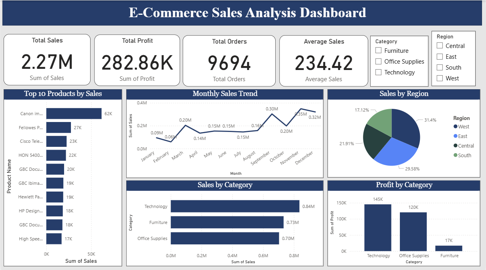

# E-Commerce Sales Analysis using SQL and Power BI

## Overview
Developed an interactive E-Commerce Sales Analysis Dashboard using SQL and Power BI to analyze sales performance, profits, customer trends, and product insights.

## Project Objective
To perform business-oriented sales analysis using SQL queries and create an interactive dashboard for data-driven decision-making.

## Tools & Technologies Used
- MySQL
- Power BI
- Data Visualization

## Analysis Performed
- Total Sales & Profit Analysis
- Monthly Sales Trend
- Region-wise Sales Analysis
- Category-wise Sales Analysis
- Profit Analysis
- Top 10 Products Analysis
- Customer & Order Insights

## Dashboard Preview

## Key Insights
- Technology category generated the highest sales and profit.
- Sales performance increased significantly during the final months of the year.
- West region contributed the highest sales.
- Interactive filters allow dynamic business analysis.
